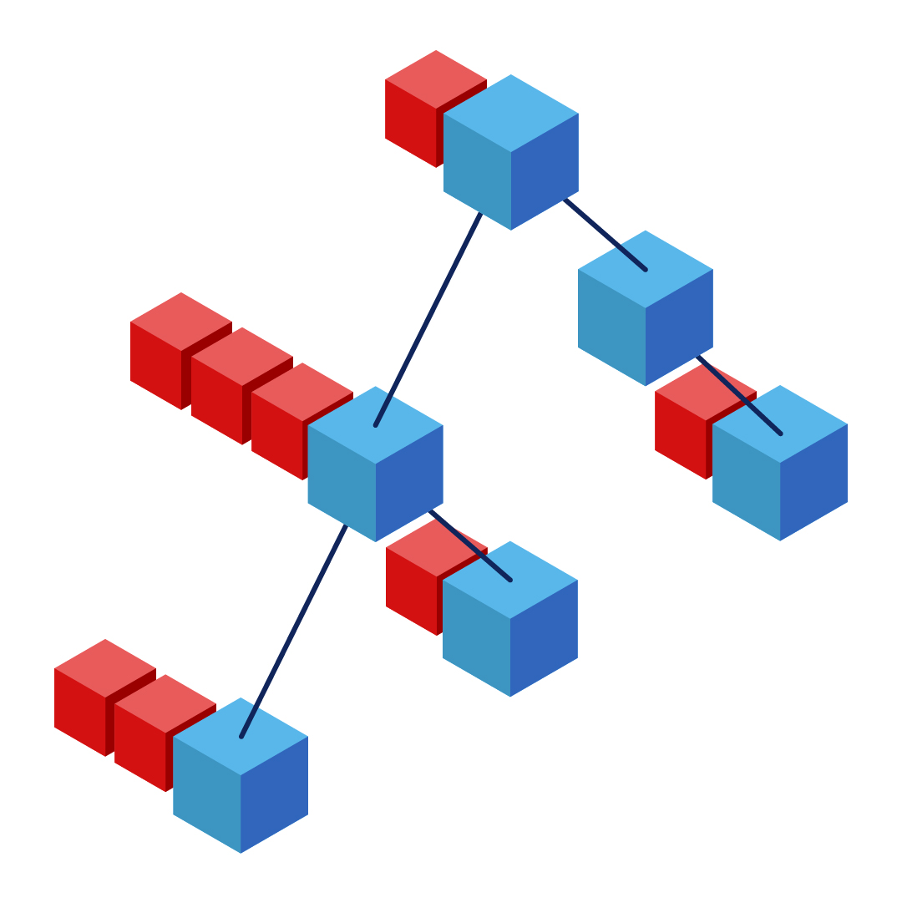

## Setup

---

`npm i` 
`npm test` 
Follow the link in your console.

## Guest List

---

Your task is to write a BST that can take people's first names (as a string) and store them under the correct letter of the alphabet.

Each node in the BST must contain a linked list that holds all the name that begins with its index letter. For example, if my party has three guests: Adam, Alice and Brian the BST will have two nodes (one for "A" and one for "B"), node "A" will have a linked list that contains "A" (the head), "Adam" and "Alice" and node "B" will contain "B"(the head) and "Brian".

New names must either be added to the correct existing linked list, or a new node and linked list must be created to house them.

Here is a graphic for a BST guest list with 8 names:

